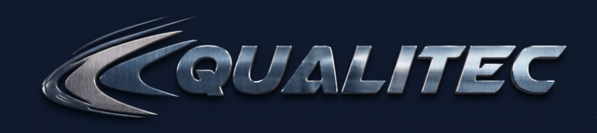

<div align="center">
  

  # Qualitec Montagens Industriais - Vitrine Digital

  <p>
    <strong>Site institucional moderno e responsivo focado em serviços de montagem e manutenção industrial.</strong>
  </p>

  <!-- Badges -->
  
  
  
</div>

<br>

## 📌 Sobre o Projeto

Este projeto é uma **Landing Page (Vitrine Digital) One-Page** desenvolvida inteiramente em Python usando o framework **Reflex**. O objetivo do site é apresentar a empresa *Qualitec Montagens e Serviços Industriais LTDA*, destacando seu portfólio, especialidades técnicas, clientes e informações de contato de forma profissional e elegante.

O projeto foi criado como parte de uma atividade de extensão universitária (70h), com foco no desenvolvimento web e em resolver uma necessidade real de apresentação digital de uma empresa do setor industrial.

## ✨ Funcionalidades e Seções

- **Hero Section:** Apresentação de alto impacto com chamadas para ação (CTAs).
- **Sobre a Empresa:** História da empresa e escopo técnico.
- **Serviços:** Grid responsivo detalhando áreas de atuação:
  - Inspeção e Soldagem
  - Tubulações e Caldeiraria
  - Manutenção e Montagem
  - Refratários e Isolamento
- **Portfólio:** Galeria de imagens com serviços reais executados.
- **Clientes:** Demonstração visual de empresas parceiras.
- **Contato:** Informações diretas (telefone, e-mail) e botão inteligente integrado com o WhatsApp.
- **Dark Mode Industrial:** Interface premium com paleta de cores foca em tons "Slate" escuros e detalhes em ciano.

## 🚀 Tecnologias Utilizadas

- **[Python 3](https://www.python.org/)** - Lógica e estrutura do projeto.
- **[Reflex](https://reflex.dev/)** - Framework full-stack para criação da interface web apenas com Python.
- **HTML/CSS (Via Reflex)** - Estilização dinâmica e responsividade nativa.

## 🛠️ Como Executar Localmente

Siga as instruções abaixo para rodar o site no seu próprio computador:

1. **Clone este repositório:**
   ```bash
   git clone https://github.com/HenryDamasceno/qualitec-vitrine.git
   ```

2. **Navegue até o diretório do projeto:**
   ```bash
   cd qualitec-vitrine
   ```

3. **Crie e ative um ambiente virtual (venv):**
   ```bash
   # Windows
   python -m venv venv
   .\venv\Scripts\activate

   # Linux/macOS
   python3 -m venv venv
   source venv/bin/activate
   ```

4. **Inicie o servidor de desenvolvimento:**
   ```bash
   reflex run
   ```

5. **Acesse no navegador:**
   Abra `http://localhost:3000` para ver o site funcionando.

## ⚙️ Como Alterar Conteúdo

Para editar textos, adicionar imagens no portfólio ou modificar links, basta abrir o arquivo principal:
`qualitec_vitrine/qualitec_vitrine.py`

O Reflex possui *hot-reload*, então qualquer alteração salva no arquivo será automaticamente atualizada no navegador. Novas imagens devem ser colocadas na pasta `assets/`.

---
<div align="center">
  <i>Desenvolvido por Henry Damasceno.</i>
</div>
